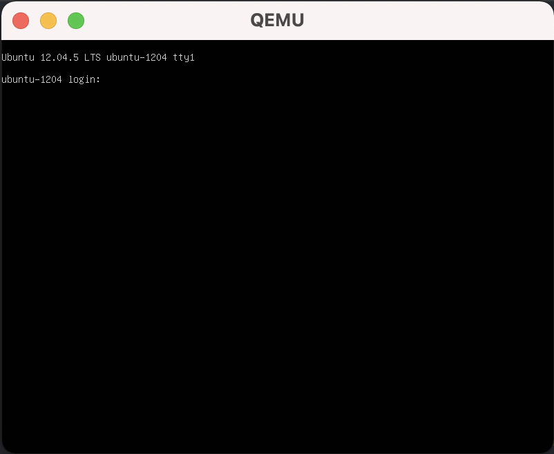

# Vagrant Qemu Provider

This is a simple [Vagrant](http://www.vagrantup.com) plugin that adds a
qemu provider to Vagrant, allowing Vagrant to control and provision
machines using qemu.

## Environment preparation
First make sure `qemu` works in your environment.
If qemu is not installed yet,
```
brew install qemu
```

It is optional, but we strongly suggest installing [qemu-virgl](https://github.com/knazarov/homebrew-qemu-virgl)
to enable graphical acceleration:
```
brew install knazarov/qemu-virgl/qemu-virgl
```

If `vagrant` is not installed yet, you should [install it](https://www.vagrantup.com)

## Build and install
```
rake build && vagrant plugin install pkg/vagrant-qemu-0.2.22.gem
```

## Demo
### Run an ARM64 VM

```shell
vagrant init billyan2018/devbox \
  --box-version 0.1.0
vagrant up --provider="libvirt"
```
Screen:


### Run an AMD64 VM

```shell
vagrant init failfish/precise64
```
Add this part in the `Vagrantfile`:
```ruby
  config.vm.provider :libvirt do |lv|
    lv.qemu_command = "qemu-system-x86_64" 
    lv.machine = "q35"
    lv.cpu = "max"
    lv.memory = "4G"
    lv.display="cocoa,gl=es"	
  end
```
Then `vagrant up --provider="libvirt"`
Screen:


## Configuration items

Item | Description | Default value
----- | ------- | -------------
qemu_command | the command to call qemu, like `qemu-system-aarch64` or `qemu-system-x86_64` | "qemu-system-aarch64"
machine |machine type, run `qemu-system-aarch64 -machine help` to see the types supported| "virt,accel=hvf,highmem=off"
cpu |run `qemu-system-aarch64 -cpu help` to check CPU supported | "host"
smp |Specify the number of cores the guest is permitted to use| "2"
memory | Memory size| "4G"
display |Available display backend types: `qemu-system-aarch64 -display help`| "cocoa,gl=es"
gpu ||"virtio-gpu-gl-pci"
mouse |mouse type|"usb-tablet"
firmware_location | The firmware to boot the machine | no value for x86, otherwise "/opt/homebrew/share/qemu/edk2-aarch64-code.fd"
additional_line |any content you would like to append at the end of the command| NA