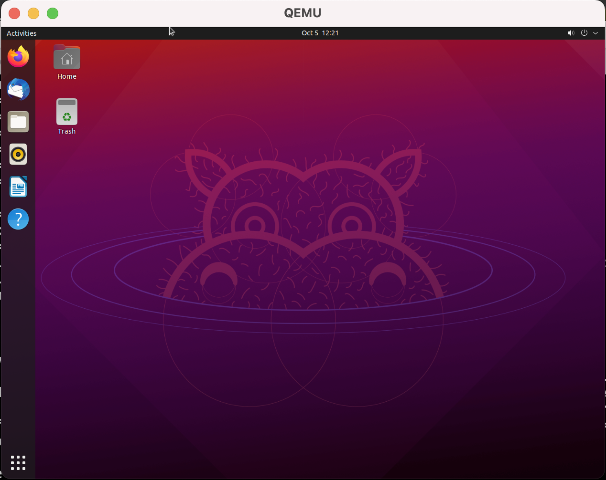

# Vagrant Qemu Provider

This is a simple [Vagrant](http://www.vagrantup.com) plugin that adds a
qemu provider to Vagrant, allowing Vagrant to control and provision
machines using qemu.

## Environment preparation
First make sure `qemu` works in your environment.
If qemu is not installed yet,
```
brew install qemu
```

It is optional, but we strongly suggest installing [qemu-virgl](https://github.com/knazarov/homebrew-qemu-virgl)
to enable graphical acceleration:
```
brew install knazarov/qemu-virgl/qemu-virgl
```
You may also need to install `libvirt`:
```shell
brew install libiconv gcc libvirt
```
If `vagrant` is not installed yet, you should [install it](https://www.vagrantup.com)

## Build and install
```
rake build && vagrant plugin install pkg/vagrant-qemu-0.2.22.gem
```

## Demo
### Run an ARM64 VM

```shell
vagrant init billyan2018/devbox \
  --box-version 0.1.0
vagrant up --provider="libvirt"
```
Screen:


### Run an AMD64 VM

```shell
vagrant init failfish/precise64
```
Then add this part in the `Vagrantfile`:
```ruby
  config.vm.provider :libvirt do |lv|
    lv.qemu_command = "qemu-system-x86_64" 
    lv.machine = "q35"
    lv.cpu = "max"
    lv.memory = "4G"
    lv.display="cocoa,gl=es"	
  end
```
Screen:
